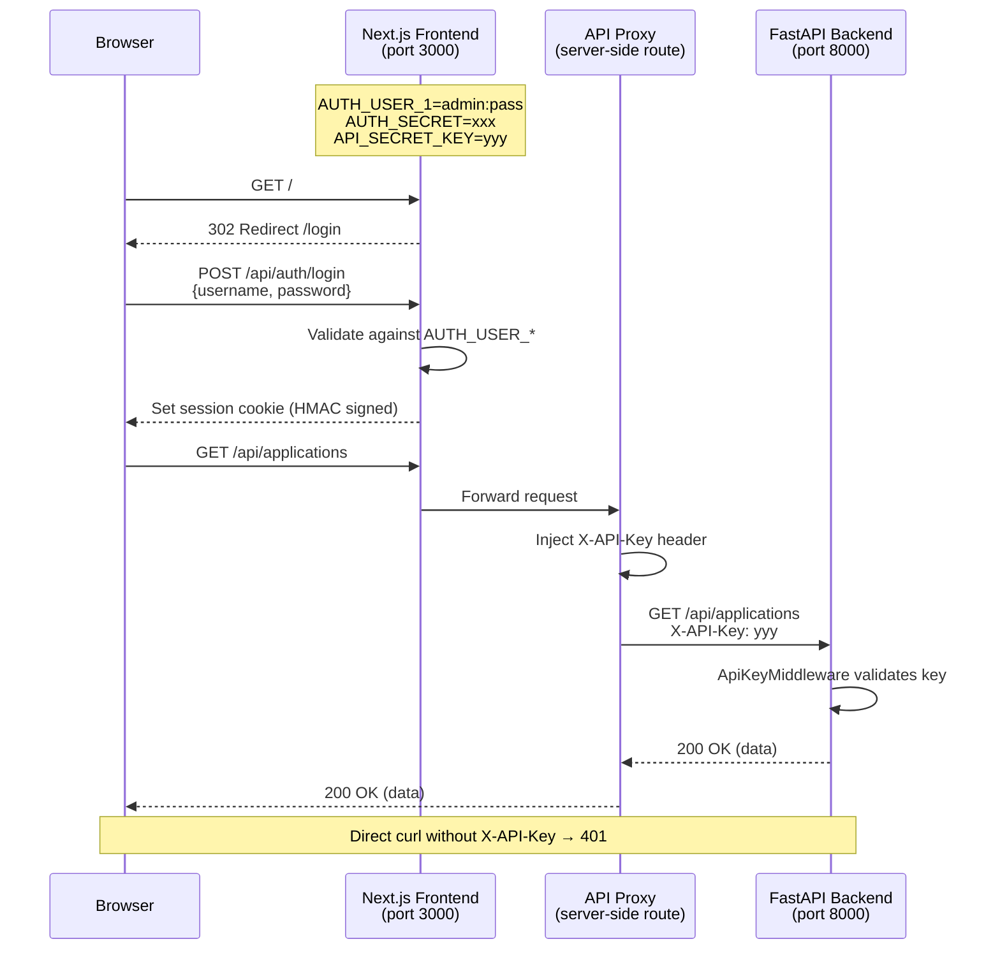
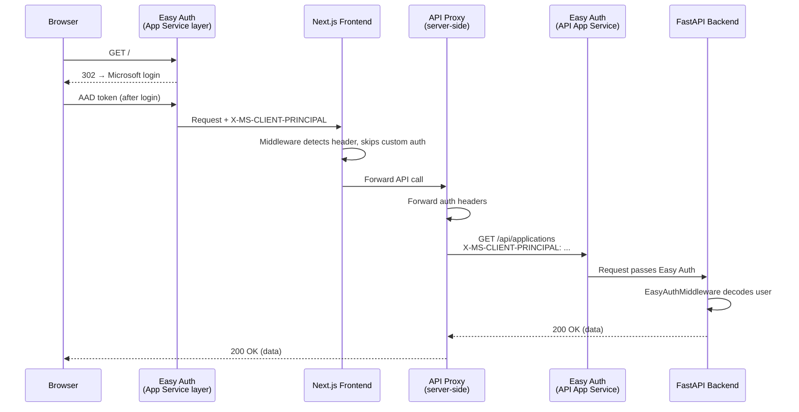
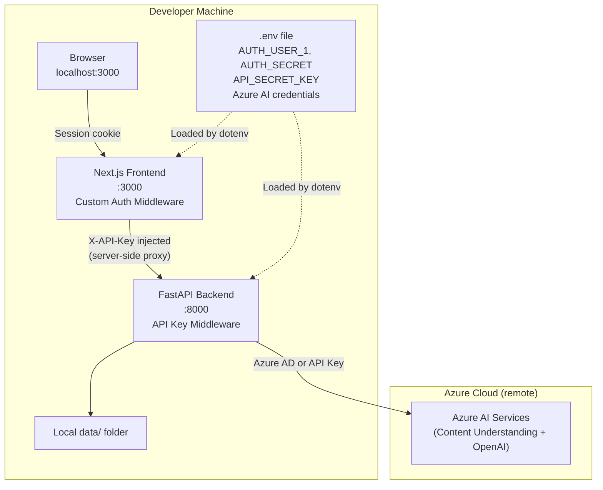
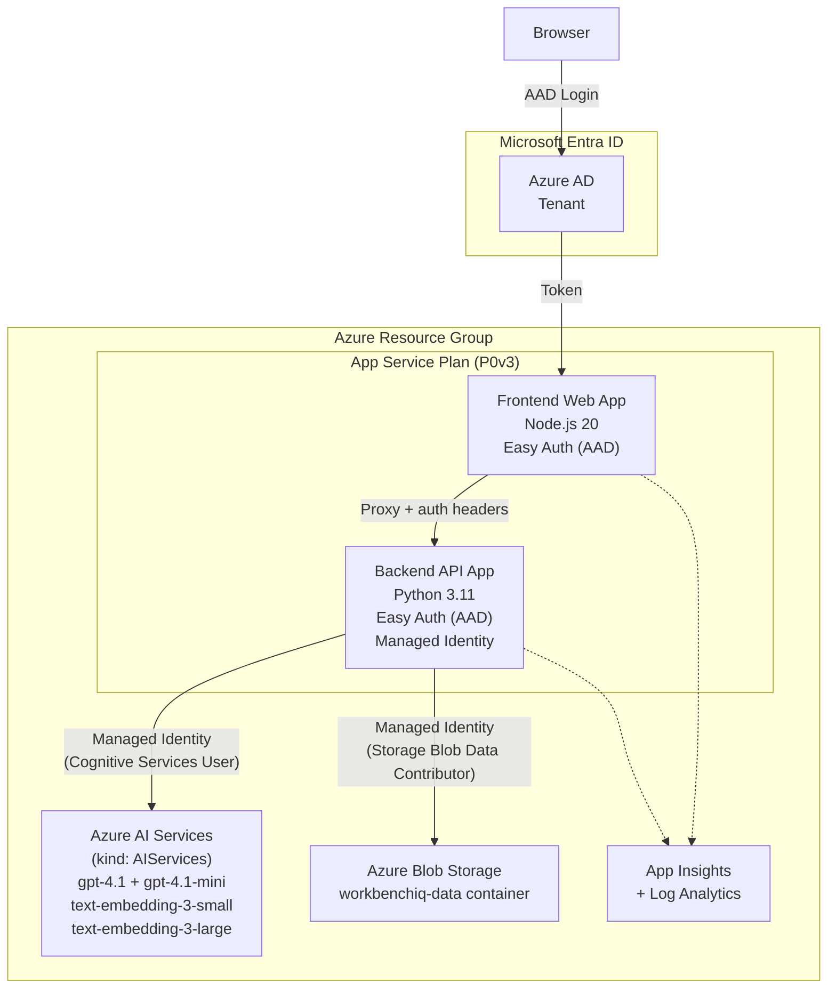
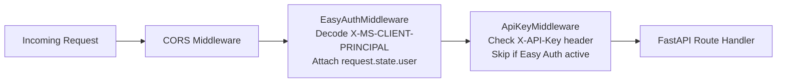
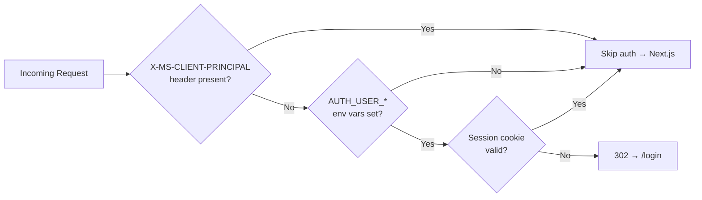

## Overview

WorkbenchIQ uses a layered authentication strategy that adapts to the environment:

- **Local development** uses API keys and username/password login
- **Azure cloud** uses Microsoft Entra ID (Easy Auth) and Managed Identity
- Both environments protect the backend API from unauthorized access

## Authentication Flow: Local Development



## Authentication Flow: Azure (Easy Auth)



## Architecture: Local Development



## Architecture: Azure Cloud



## Security Layers by Environment

| Layer | Local Dev | Azure Cloud |
|-------|-----------|-------------|
| **Frontend (browser)** | Custom login (`AUTH_USER_*`) | Easy Auth (Entra ID AAD) |
| **Backend API** | API key (`API_SECRET_KEY`) | Easy Auth (Entra ID AAD) |
| **AI Services** | Azure AD token (`az login`) | Managed Identity (RBAC) |
| **Blob Storage** | Azure AD token (`az login`) | Managed Identity (RBAC) |
| **Swagger UI** | Open (for development) | Protected by Easy Auth |

## Middleware Execution Order (Backend)



## Middleware Execution Order (Frontend)



## Setup Commands

### Local development

```bash
# One-time: generate auth credentials
python scripts/setup_auth.py --auto

# Start backend
uv run python -m uvicorn api_server:app --reload --port 8000

# Start frontend
cd frontend && npm run dev
```

### Azure deployment

```bash
# One command to provision + deploy everything
azd up

# Optional: enable Easy Auth (after deployment)
azd env set AUTH_TENANT_ID $(az account show --query tenantId -o tsv)
azd up
```

### Tear down Azure resources

```bash
azd down --purge
```
